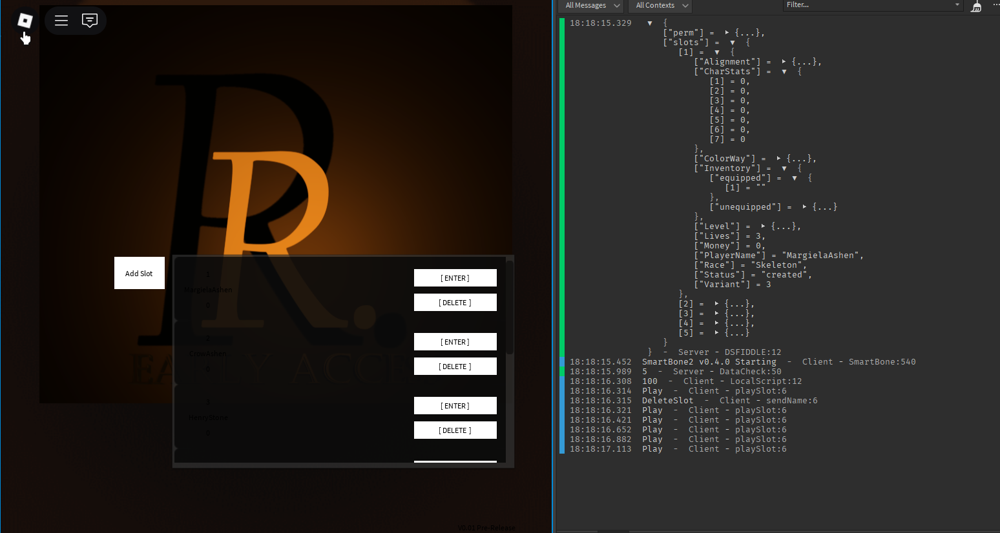
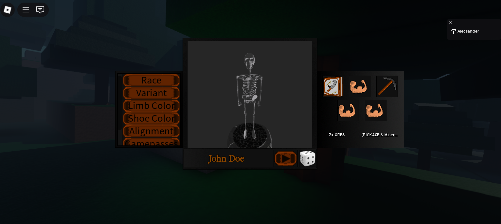

# 🌐 Project Name Overview

This is an overview of **Remembrance**, a game built using purely Luau. All gameplay visuals created by author, and a majority of UI visuals.

> 🚀 **Live site:** [Roblox Page:](https://www.roblox.com/games/131450869711405/)

---

## 📸 Screenshots

---

## 📝 Project Summary

**Project Name** is planned to be a online RPG that includes features such as:

- ✅ PvP Combat
- 📈 Custom 3D modeling
- 🔐 Animation Engine
- 

---

## 🛠 Tech Stack

- **Full-Stack:** Luau

- Additional Frameworks:
* SmartBones, Packets

---

## 🎯 Purpose

This project was built to attempt to seemlessly platform a combat RPG that is hard to exploit on the client side.

---

## 📅 Timeline

- Started: Jan 2025
- Status: [In Progress]

---

## 🙋‍♂️ Author

- [Github Profile](https://github.com/KingToxic)

